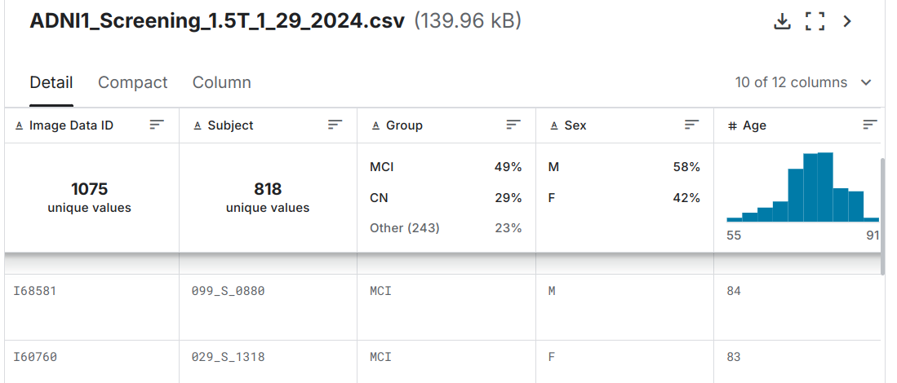

* 任务概述

将`fastsurfer`预处理后的数据进行整理，整理成`csv`格式，并注明如何使用。完成后可阅读`fastsurfer`文档了解清楚各个sample的features是什么含义，怎么使用，再对数据进行修剪

[fastsurfer github](https://github.com/Deep-MI/FastSurfer)

* 数据整理

**注意：保留所有`stats`目录下的所有原始数据，仅仅是整理无关内容，如注释等，而非删减数据**，dir命名为`tidy`

* 数据修剪

根据自己读的论文和fastsurfer文档，进行数据修剪，可以修剪成多个版本（写清楚修剪依据，和使用方法），dir命名为`prune`

* 数据源

<https://www.kaggle.com/datasets/mdfahimbinamin/adni-screening-1-5t-ad-complete-dataset>

<https://www.kaggle.com/datasets/mdfahimbinamin/adni-screening-1-5t-mci-complete-dataset>

<https://www.kaggle.com/datasets/mdfahimbinamin/adni-screening-1-5t-cn-complete-dataset>

共3个，注意上面的数据在`stats`目录下有`aseg+DKT.stats` and `cerebellum.CerebNet.stats`

--------------------

以下给出我用`fastsurfer`执行`--seg_only`得到的`stats`数据

[I118670.tar.gz](../dataset/I118670.tar.gz)

可以看到`stats`里有三个文件，两个和上面是一样的，还有一个，自行了解是什么意思

其实kaggle上的数据已经够用了，这个新的数据我也正在计算生成中，你先把kaggle上的数据处理好，新的数据后续添加

* 数据features大致要求

原始数据的`headers`要求包括基本的`# ColHeaders  Index SegId NVoxels Volume_mm3 StructName normMean normStdDev normMin normMax normRange `

还要有

注意`unique id`

加油！

